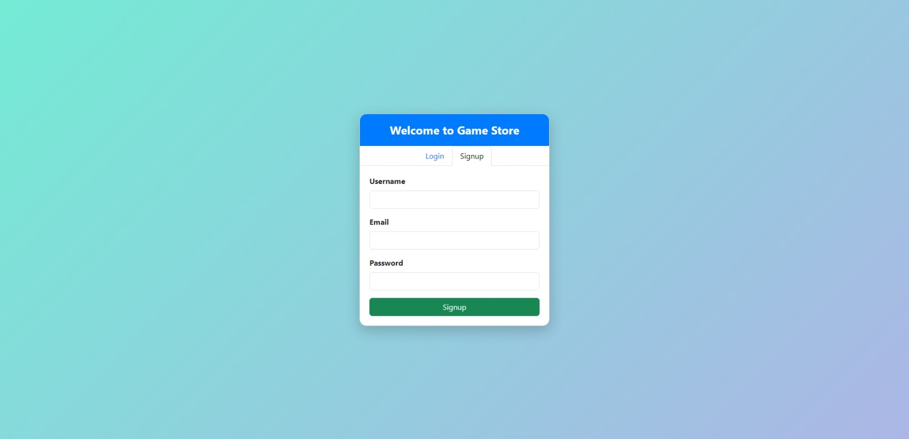
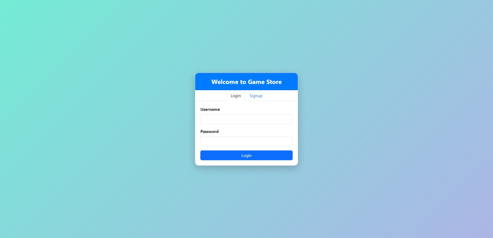
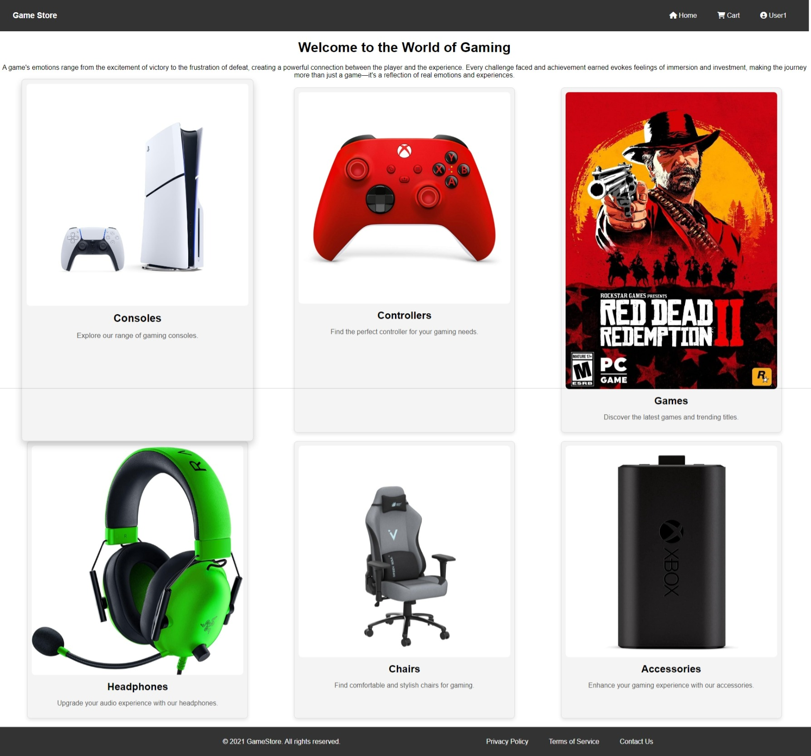
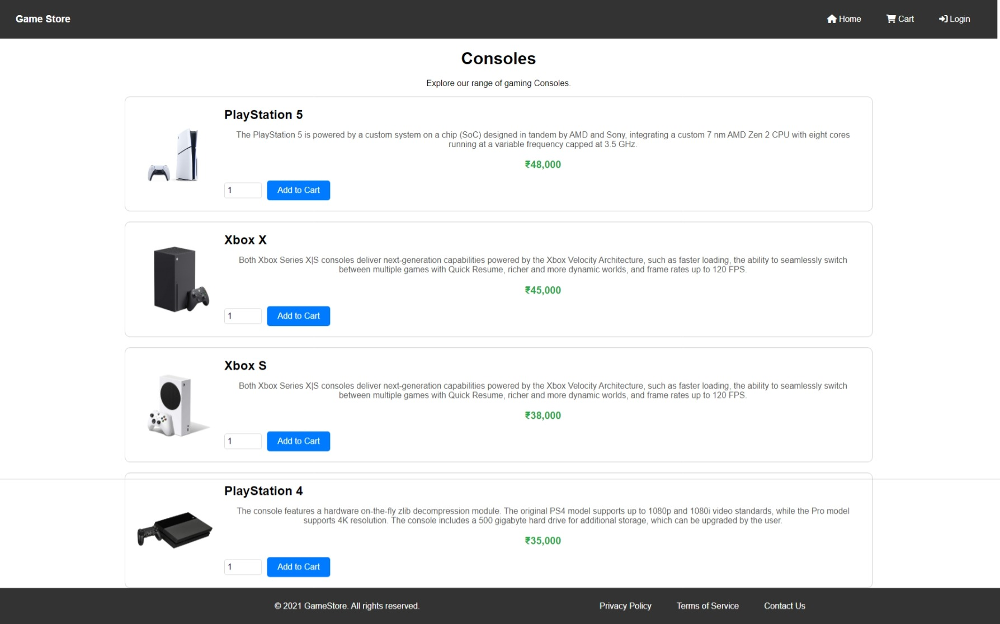
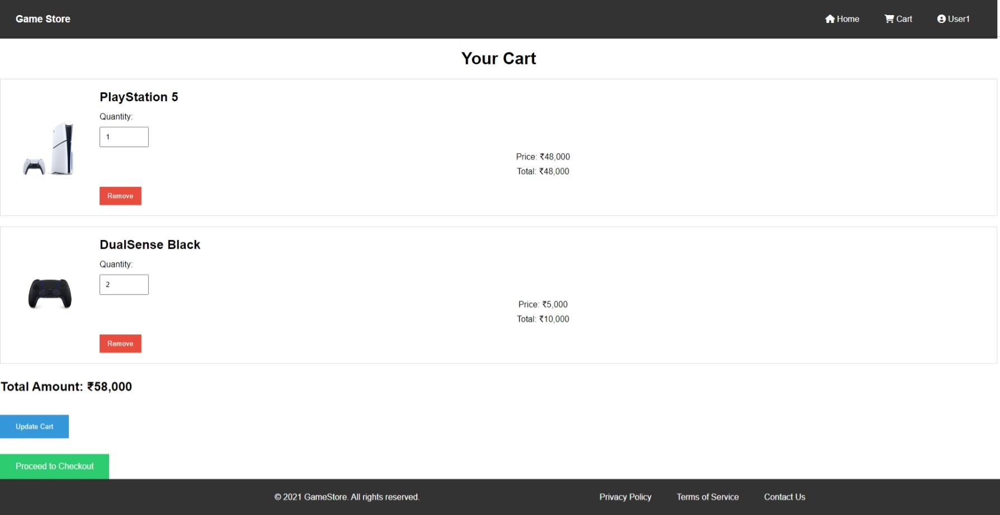
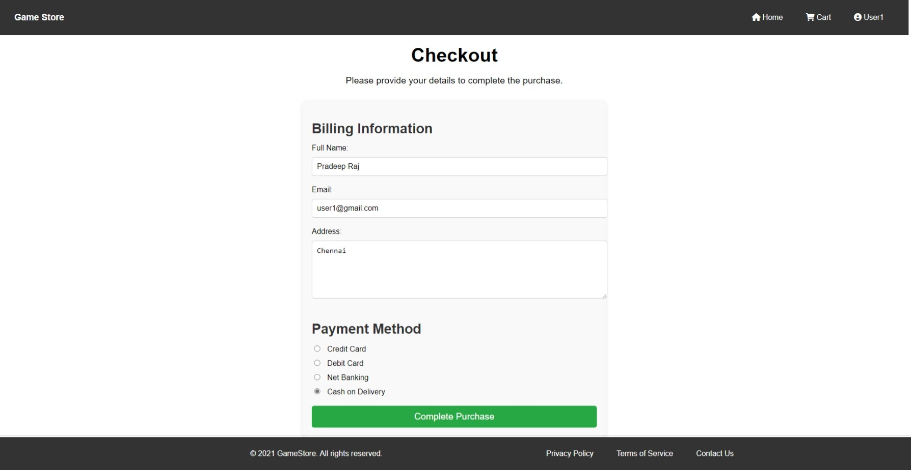
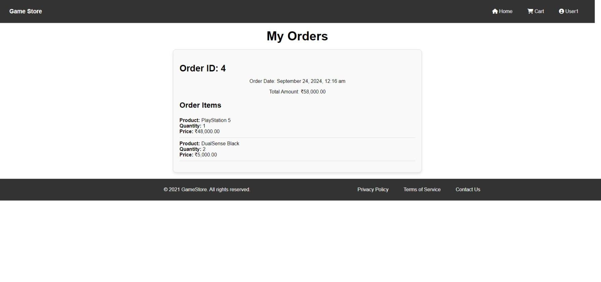
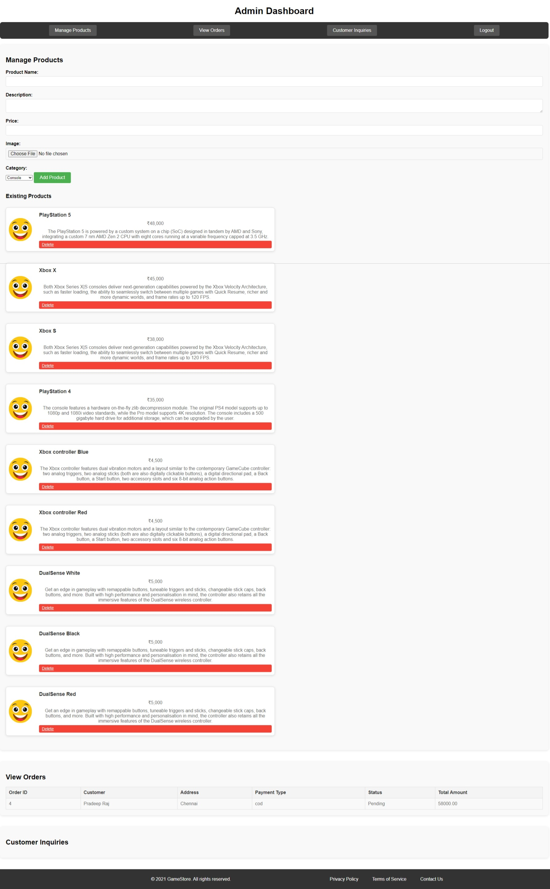

# Game Store

A full-fledged game store application built with PHP, featuring a complete e-commerce experience with functionalities such as user authentication, product browsing, shopping cart, checkout, order tracking, and an admin dashboard for product and order management.

## Features

- **User Authentication:**
  - Signup and login functionalities with session management.
  
- **Product Management:**
  - Browse products by category.
  - Add products to the shopping cart.
  - Update cart quantities and remove items.
  
- **Checkout Process:**
  - Complete checkout with order summary and payment options.
  
- **Order Tracking:**
  - View and track past orders.

- **Admin Dashboard:**
  - Manage products: add, edit, and delete products.
  - View and update order statuses.
  - Customer inquiries and site settings.

## Pages Overview

### 1. Signup Page


### 2. Login Page


### 3. Home Page


### 4. Product Listing Page


### 5. Cart Page


### 6. Checkout Page


### 7. Orders Page


### 8. Admin Dashboard


## Installation

1. **Clone the repository:**
    ```bash
    git clone https://github.com/achilles1305/GameStore.git
    ```

2. **Navigate to the project directory:**
    ```bash
    cd GameStore
    ```

3. **Setup the database:**
    - Import the `gamestore.sql` file into your MySQL database.
    - Update the database connection details in `includes/db_connect.php`.

4. **Run the application:**
    - Host the project on a local server using XAMPP, WAMP, or any PHP server.
    - Access the project via `http://localhost/gamestore`.

## Usage

1. **User Registration and Login:**
   - Register a new user or login with an existing account.
   
2. **Browsing Products:**
   - Browse through various product categories and add items to the cart.
   
3. **Cart and Checkout:**
   - Review the cart items and proceed to checkout to place an order.

4. **Admin Dashboard:**
   - Manage products, view orders, and handle customer inquiries.

## Contributing

Contributions are welcome! Please submit a pull request for any improvements or feature additions.

## License

This project is licensed under the [MIT License](LICENSE).

---

**Note:** For any issues or questions, feel free to open an issue on the repository.

